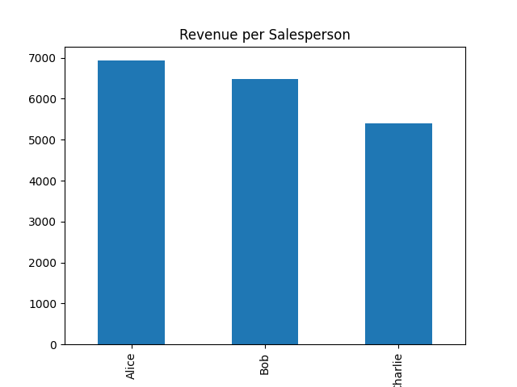
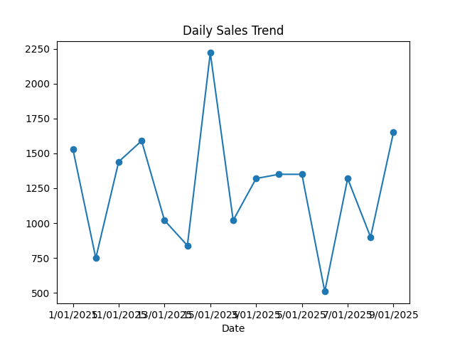

# Sales KPI Calculator

## Project Goal
Calculate key sales metrics from a sample sales dataset and visualize trends.

## Data
- **File:** `data/sales_data.csv`
- **Columns:**
  - `Date` – Transaction date
  - `Salesperson` – Name of salesperson
  - `Product` – Product sold
  - `Quantity` – Units sold
  - `Revenue` – Revenue for the transaction

## KPIs Calculated
- Total revenue per salesperson
- Total revenue per product
- Top-selling product
- Daily sales trends

## Outputs
- Summary tables printed in Python console
- Charts saved to `outputs/charts/`:
  - `revenue_per_salesperson.png`
  - `revenue_per_product.png`
  - `daily_sales_trend.png`

## Tools Used
- Python 3
- pandas
- matplotlib

## Steps
1. Load the CSV file.
2. Calculate KPIs.
3. Generate charts.
4. Save outputs in `outputs/charts/`.
5. Update README with insights after analysis.

## Insights
- The top salesperson this week was **Alice**, with total revenue of $6930.
- **Laptop** was the highest-grossing product, contributing 10800 to the total revenue.
- Daily sales peaked on **15/01/2025**, with a total revenue of $2200.
- Opportunity identified: focus marketing on Laptop and target low-sales days to boost revenue.

## Charts

